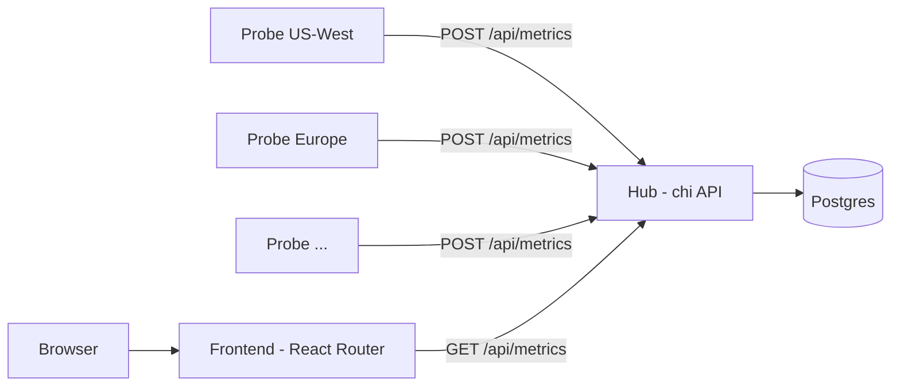

# Global Latency Tracker

A distributed HTTP latency monitor. Lightweight **probes** run in different regions, measure DNS / TCP / TLS / TTFB / round-trip timings against a target URL, and POST the results to a central **hub**. The hub (chi + Postgres) stores them and serves an authenticated JSON API, and a React Router dashboard renders the latest status and latency per region on a live world map.

Probes are deployed across five regions on Fly.io - US-West (Los Angeles), South America (Sao Paulo), Europe (Amsterdam), Asia (Singapore), and Africa (Johannesburg) - all measuring latency to the target in Zurich (ETH Zurich).


## Architecture



## Components

- **`cmd/hub` + `internal/hub/*`** - HTTP API (chi), API-key auth via `X-API-Key`, Postgres storage, goose migrations (auto-applied on start), and a background retention cleanup job.
- **`cmd/probe` + `internal/probe`** - the probe binary that times an HTTP request to the target and reports it to the hub.
- **`frontend/`** - dashboard built with Bun + React Router 7 (SSR loader + client-side refresh).

## Quick start

Start Postgres and configure environment:

```bash
docker compose -f deploy/docker-compose.yml up -d postgres
cp .env.example .env
```

Run the hub (applies migrations automatically), a probe, and the frontend in separate terminals:

```bash
go run ./cmd/hub
go run ./cmd/probe
cd frontend && bun install && bun run dev
```

The dashboard is then available at http://localhost:5173. To run the whole stack in containers instead:

```bash
docker compose -f deploy/docker-compose.yml up --build
```

## Configuration

Environment variables (see [.env.example](.env.example)):

- `DATABASE_URL` - Postgres DSN used by the hub.
- `API_KEY` - shared secret required on all `/api` routes (sent as `X-API-Key`).
- `PROBE_TARGET_URL` - URL the probe measures.
- `PROBE_REGION` - region label attached to each result.
- `PROBE_INTERVAL` - time between probes (e.g. `60s`, default `60s`).
- `HUB_URL` - hub base URL the probe posts to.
- `API_BASE_URL` - hub base URL the frontend reads from.
- `PORT` - hub listen port (default `8080`).
- `PROBE_RESULTS_RETENTION` - how long to keep results (default `168h`).
- `PROBE_RESULTS_CLEANUP_INTERVAL` - retention sweep interval (default `24h`).

## API

All `/api` routes require the `X-API-Key` header.

- `GET /healthz` - liveness/readiness (checks the database).
- `GET /api/metrics?limit=&offset=&target_url=` - list recent probe results.
- `GET /api/metrics/{id}` - fetch a single result.
- `POST /api/metrics` - ingest a probe result.

Example result payload:

```json
{
  "target_url": "https://example.com",
  "region": "US-West",
  "status_code": 200,
  "dns_lookup_ms": 12.34,
  "tcp_connection_ms": 8.21,
  "tls_handshake_ms": 21.5,
  "server_processing_ms": 45.7,
  "ttfb_ms": 88.9,
  "total_roundtrip_ms": 95.2,
  "measured_at": "2026-06-01T09:00:00Z",
  "error": null
}
```

## Testing

```bash
go test ./...        # unit tests (no database required)
make test-integration # Postgres-backed integration tests (needs TEST_DATABASE_URL)
```

## Deployment

Container images are built from [deploy/Dockerfile.hub](deploy/Dockerfile.hub) and [deploy/Dockerfile.probe](deploy/Dockerfile.probe). Per-region probe configs for Fly.io live in [deploy/probes/](deploy/probes/).
